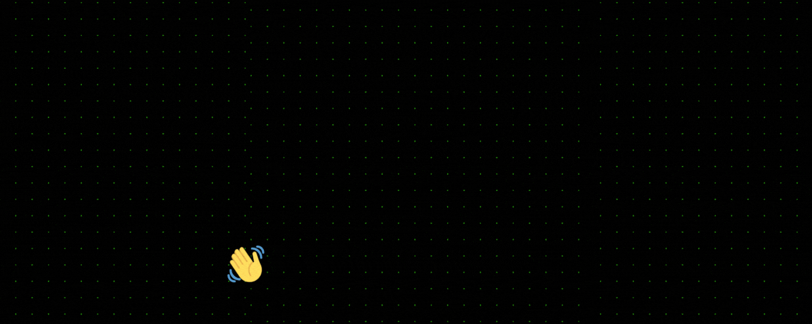

  

###

<h2 align="left">I'm a Full-Stack Web Developer 💻</h2>

###

📚 I'm currently learning **Node.js**   🎯 My main goal is to land my **dream job as a developer** in 2024 🧠 I have a **growth mindset**, thus I strongly believe that we can develop our skills and talents through hard work and patience ⛰️ In my free time I love hiking in the mountains and climbing 🌍 Based in **Italy** but willing to move to other European countries

###

<h2 align="left">I code with</h2>

###

  
  
  
  
  
  
  
  
  
  
  
  
  

###

<h2 align="left">Favorite quote</h2>

###

  
  > _“Talent wins games, but teamwork and intelligence win championships.”_ **Michael Jordan**
  

###

<h2 align="left">Keep in touch</h2>

###

  

<!---
massimorabuffo/massimorabuffo is a ✨ special ✨ repository because its `README.md` (this file) appears on your GitHub profile.
You can click the Preview link to take a look at your changes.
--->
